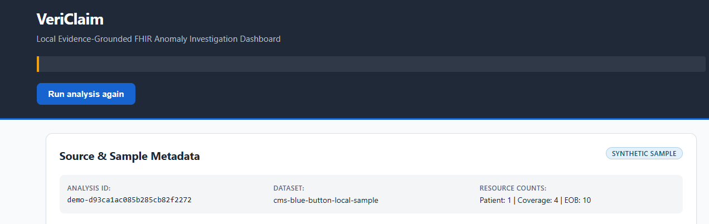
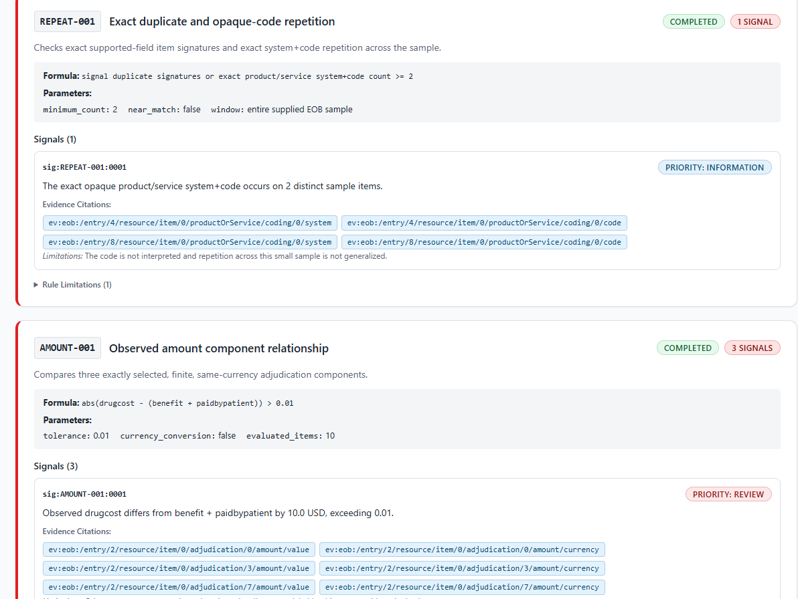

# VeriClaim

<div align="center">
  
</div>

VeriClaim is a local, evidence-grounded investigation application for synthetic FHIR R4 claim data. It combines transparent deterministic checks with an optional, tightly bounded Vertex AI Gemini summary, then presents every result in an accessible React dashboard with traceable evidence citations.

The system analyzes a fixed CMS Blue Button sample containing `Patient`, `Coverage`, and `ExplanationOfBenefit` resources. Deterministic rules identify review signals; Gemini can summarize only the supplied facts and signals. Model output never creates rules, changes evidence, or makes claim, fraud, payment, coverage, coding, or clinical decisions.

## Highlights

- **Explainable analysis:** five deterministic rules expose their formulas, inputs, signals, missing evidence, and limitations.
- **Traceable evidence:** stable RFC 6901-based identifiers connect observed facts, rule signals, and candidate findings to their source locations.
- **Safe model boundary:** Gemini receives minimized structured data, has no tools, and may be called at most once per analysis.
- **Resilient results:** deterministic output remains available when model configuration, provider calls, timeouts, schema validation, or evidence validation fail.
- **Accessible dashboard:** keyboard-friendly evidence navigation, responsive layouts, visible focus states, reduced-motion support, and WCAG-oriented contrast.
- **Contract-driven integration:** FastAPI publishes the OpenAPI contract used to generate strict TypeScript types for the frontend.
- **Local-first data boundary:** source files are read-only, processing is in memory, and the browser never receives cloud credentials or provider configuration.

## Dashboard

The dashboard separates source metadata, observed facts, deterministic rule results, Gemini candidate findings, and the evidence index so each layer can be inspected independently.

<div align="center">
  
</div>

## How it works

```text
React dashboard
  -> POST /api/v1/analyze-demo through the local Vite /api proxy
  -> FastAPI loads three allowlisted, read-only FHIR JSON files
  -> bounded Patient/Coverage/EOB extraction
  -> stable observed-fact evidence index
  -> five deterministic anomaly checks
  -> zero or one Vertex AI Gemini structured-summary call
  -> Pydantic schema and evidence-reference validation
  -> deterministic-first report with navigable citations
```

All analysis is performed in memory. There is no database, arbitrary file upload, remote input URL, authentication layer, RAG pipeline, agent loop, or browser-side model access.

## Deterministic rules

| Rule | Purpose | Behavior |
|---|---|---|
| `REF-001` | Reference integrity | Checks that required local `Patient/<id>` and `Coverage/<id>` references resolve exactly once; distinguishes missing, malformed, wrong-type, unresolved, and ambiguous references. |
| `DATE-001` | Coverage date bounds | Compares each available `item.servicedDate` with the present bounds of its uniquely resolved Coverage period. Missing dates or bounds are reported as missing evidence. |
| `REPEAT-001` | Exact repetition | Detects exact supported-field item signatures and repeated opaque product/service system-and-code pairs across distinct sample items. It performs no near matching or terminology interpretation. |
| `AMOUNT-001` | Amount relationship | Checks whether `abs(drugcost - (benefit + paidbypatient)) > 0.01` when exactly one same-currency value exists for every required component. |
| `OUTLIER-001` | Sample-relative high amount | Groups `drugcost` observations by exact currency and applies the Tukey threshold `Q3 + 1.5 × IQR` when at least four values are available. |

Signal priorities such as `information` and `review` are presentation aids, not risk scores or determinations.

## Technology

| Layer | Technology |
|---|---|
| Frontend | React 19, strict TypeScript, Vite, generated OpenAPI types |
| Backend | Python 3.12, FastAPI, Pydantic |
| Model integration | Google Gen AI SDK configured for Vertex AI Gemini |
| Testing | pytest, Vitest, React Testing Library, Playwright, axe-core |
| Contract | OpenAPI 3.1 |
| Data | Versioned synthetic CMS Blue Button FHIR R4 JSON |

## Getting started

### Prerequisites

- Python 3.12
- Node.js 24 LTS and npm
- Optional: a Google Cloud project with Vertex AI access and Application Default Credentials

### 1. Set up the backend

From the repository root:

```bash
python3 -m venv .venv
.venv/bin/python -m pip install --upgrade pip
.venv/bin/python -m pip install -r backend/requirements.txt
cp .env.example .env
```

The Vertex AI integration is optional. To enable it, replace the placeholders in `.env` and configure Application Default Credentials outside the repository:

```dotenv
GOOGLE_CLOUD_PROJECT=your-google-cloud-project
GOOGLE_CLOUD_LOCATION=your-vertex-ai-region
GOOGLE_GENAI_USE_VERTEXAI=true
VERTEX_GEMINI_MODEL=your-approved-gemini-model
```

When model configuration is absent, VeriClaim still returns the complete deterministic report and sets `gemini.status` to `configuration_error`.

Start the API:

```bash
.venv/bin/python -m uvicorn backend.app.main:app \
  --host 127.0.0.1 \
  --port 8000 \
  --env-file .env
```

FastAPI documentation is available at [http://127.0.0.1:8000/docs](http://127.0.0.1:8000/docs).

### 2. Start the dashboard

In a second terminal:

```bash
cd frontend
npm ci
npm run dev
```

Open [http://127.0.0.1:5173](http://127.0.0.1:5173) and select **Run analysis**. Vite proxies the browser's relative `/api` request to the local FastAPI server at `http://127.0.0.1:8000`.

### 3. Call the API directly

The analysis operation has no request body, file parameter, path parameter, or remote URL:

```bash
curl -X POST http://127.0.0.1:8000/api/v1/analyze-demo
```

It always analyzes these versioned synthetic inputs:

- `dataset/patient_bbuser29999.json`
- `dataset/coverage_bundle_bbuser29999.json`
- `dataset/eob_bundle_bbuser29999.json`

## Response model

The API response keeps deterministic evidence and model-generated text separate:

```json
{
  "analysis_id": "demo-d93ca1ac085b285cb82f2272",
  "source": {
    "dataset_name": "cms-blue-button-local-sample",
    "synthetic": true,
    "resource_counts": {
      "Patient": 1,
      "Coverage": 4,
      "ExplanationOfBenefit": 10
    }
  },
  "observed_facts": [],
  "rule_results": [],
  "evidence_index": [],
  "gemini": {
    "status": "success",
    "summary": "Bounded candidate summary based only on supplied synthetic evidence.",
    "candidate_findings": [],
    "missing_evidence": [],
    "limitations": []
  },
  "model_metadata": {
    "provider": "vertex-ai",
    "invoked": true,
    "call_count": 1,
    "output_validated": true
  },
  "limitations": []
}
```

The complete schema, including rule metadata, evidence records, typed model failures, and the sanitized deterministic-pipeline error response, is defined in [`contracts/openapi.yaml`](contracts/openapi.yaml).

## Model safety and failure handling

Gemini receives only minimized synthetic facts, deterministic signals, supplied evidence identifiers, and explicit limitations. It does not receive credentials, full FHIR resources, unnecessary patient attributes, tools, file access, or external retrieval.

Structured output must pass both Pydantic validation and evidence-reference allowlisting. The supported model states are:

- `success`
- `configuration_error`
- `timeout`
- `provider_error`
- `invalid_output`
- `invalid_evidence`

Every model failure state returns HTTP 200 after deterministic analysis succeeds, with the full deterministic report preserved and no candidate findings. Unsafe source, JSON, shape, or extraction failures return a sanitized HTTP 500 response and do not invoke Gemini.

## Verification

Run the backend test suite from the repository root:

```bash
.venv/bin/python -m pytest -q tests/backend
```

Run the frontend checks:

```bash
npm --prefix frontend run check:api
npm --prefix frontend run lint
npm --prefix frontend run typecheck
npm --prefix frontend run test:unit
npm --prefix frontend run build
```

For the complete frontend pipeline, install the lock-matched Chromium browser once and run:

```bash
npm --prefix frontend exec playwright install chromium
npm --prefix frontend run verify
```

The test suites cover extraction boundaries, stable evidence IDs, every rule path, model failures, one-call enforcement, endpoint contracts, source immutability, safe rendering, response states, keyboard navigation, responsive layouts, and accessibility-critical behavior.

## Project structure

```text
VeriClaim/
├── backend/app/          FastAPI service, extraction, rules, and Gemini boundary
├── contracts/            Authoritative OpenAPI and FHIR interface artifacts
├── dataset/              Read-only synthetic FHIR R4 sample files
├── docs/                 Product, architecture, ADR, and feature documentation
├── frontend/             React and TypeScript dashboard
│   ├── img/              README and dashboard images
│   └── src/              UI, API adapter, generated types, and tests
├── tests/backend/        Backend unit and integration tests
└── .ai/                  Deterministic project and task configuration
```

## Scope and limitations

- VeriClaim supports a deliberately narrow FHIR-shaped subset; it is not a comprehensive FHIR validator or a strict CARIN conformance implementation.
- The included data is synthetic and too small to represent a payer, population, benchmark, or production distribution.
- Product/service codes remain opaque values. The system does not infer terminology, policy, clinical meaning, medical necessity, or payment correctness.
- Gemini output is variable, candidate-only, and non-authoritative even after schema and citation validation.
- The local unauthenticated API and dashboard are not a deployment security model. Shared or production use would require a separately approved architecture.
- The project does not accept or process real PHI and makes no compliance or production-readiness claim.
